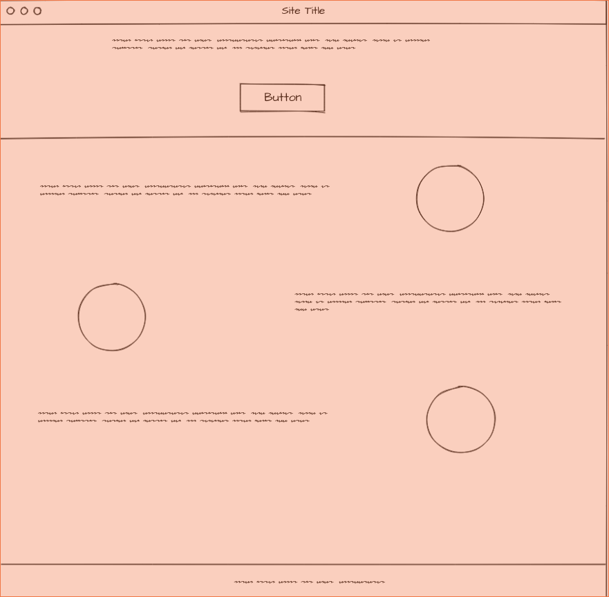

# All hands on deck! Challenge (AHOD)

- repository : `becode-AHOD`
- team : `false`
- Durée : `6 hours`

## One-Pager Website
- **Client**: Scout Unite 48e Impeesa

- **Qui ?** : [Claude Janssen](https://github.com/ClaudeJanssenPro)
              [Mariane Niwemfura](https://github.com/MarianeNiwe)
              [Hakan Poyraz](https://github.com/Plouck)

- **Quand?**: Le 07 Juin 2018 de 10 a 16h.

- **Ou ?**  : A[Becode](https://github.com/becodeorg/)

## Resume du **Project**

Notre groupe doit travaler sur un projet (un site inexistant), et doit réaliser et déployer en quelques heures un one-pager qui propose une meilleure version de ce projet, attractif, allant à l'essentiel, en utilisant un framework CSS, avec au moins une animation CSS.

Ceci est pour nous aider à apprendre comment réaliser un projet dans des situations réelles, mais ne sera pas donné à un client,c'est juste un exercice de [BeCode](https://github.com/becodeorg/lovelace-2/tree/master/Projects/challenge-six-hours-team).
Pour cela, nous avons dû créer un nouvel site web basé sur notre imagination en utilisant un [template](https://blackrockdigital.github.io/startbootstrap-one-page-wonder/).

## Objectifs

- Introduction au User-Centered Design
- Travail de groupe coordonné avec de nouveaux collaborateurs
- Introduction aux PWA
- Travailler les animations CSS
- Voir comment réaliser en urgence un site web d' une page (= un "one-pager"), sur base de templates existantes. Guerilla style.
- Utiliser des outils de validation, tels que le Lighthouse Test ou le W3C Validator, pour améliorer ses compétences de frontend
- Travailler les compétences acquises dans un cas concret
- Découvrir les vertus du [suffisfaisant](https://fr.wikipedia.org/wiki/Satisficing) comme alternative au perfectionnisme.

## Méthodes de travail

1. Pour terminer a temps, nous avons d'abord commence a creer un repositoire et partage les taches apres chaqu'un a cree une branche base sur ce qu'il devrait faire.
2. Comme nous n'avions pas un site existants nous avons du chercher les elements pour creer le site.
3. Nous avons aussi creer un Mockup pour voir un peu l'idee de ce que nous avons besoin de creer comme site.

**L'idee du projet8**

## Test lighthouse

Nous pouvons pas vraiment dire que le résultat est assez satisfaisant mais dans un delais de 6heures c'est mieux.

## Difficultés rencontrées

- Designer le site c'est un peu complique pour nous,ca serait mieux si nous avions un site existant pour voir l'idee du client.
- 

- remise: [formulaire](https://goo.gl/forms/ov5m6hVD4ZUxY2Yc2)
